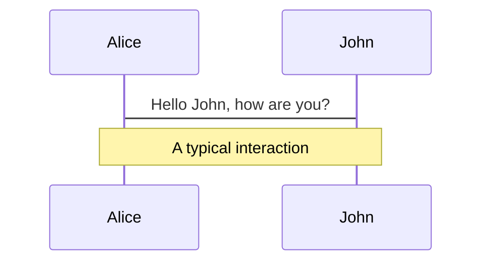
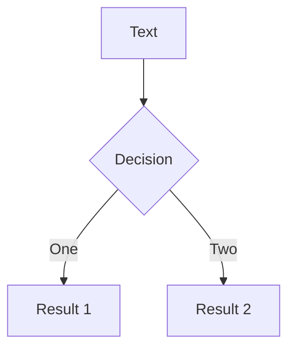
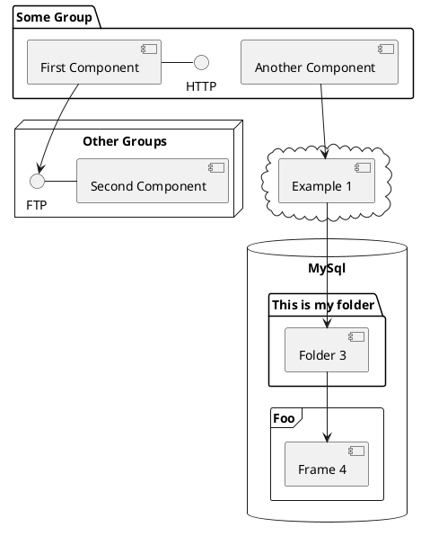

# Built-in Vue Components

Usefull tools for a Web Developer

---

# What is a Built-in Component?

A Built-in component is a a component that can be used directly in templates without needing to be registered.

- 🔴 **Transition** - provides animated transition effects to a single element or component.
- 🎨 **TransitionGroup** - provides transition effects for multiple elements or components in a list.
- 👩‍⚕️ **KeepAlive** - Caches dynamically toggled components wrapped inside.
- 🧙 **Teleport** - Renders its slot content to another part of the DOM.
- ⏳ **Suspense** - Used for orchestrating nested async dependencies in a component tree (Experimental).

<br>
<br>
<br>
<br>

Read more about [Built-in Component](https://vuejs.org/api/built-in-components.html)

---

# Transition

It can be used to apply enter and leave animations on elements or components passed to it via its default slot. The enter or leave can be triggered by one of the following:

- Conditional rendering via v-if
- Conditional display via v-show
- Dynamic components toggling via the component special element

---

# Transition Props

<br>

```ts {all|2|3|4|5|6|7|8-16}
interface TransitionProps {
  name?: string
  css?: boolean
  type?: 'transition' | 'animation'
  duration?: number | { enter: number; leave: number }
  mode?: 'in-out' | 'out-in' | 'default'
  appear?: boolean
  enterFromClass?: string
  enterActiveClass?: string
  enterToClass?: string
  appearFromClass?: string
  appearActiveClass?: string
  appearToClass?: string
  leaveFromClass?: string
  leaveActiveClass?: string
  leaveToClass?: string
}
```

Read more about [Props and events](https://vuejs.org/api/built-in-components.html#transition) for Transition component

---

# Transition Example

A simple example for Transition component

<TransitionComponent />

---

# TransitionGroup

<div>
TransitionGroup supports the same props, CSS transition classes, and JavaScript hook listeners as Transition, with the following differences:

<br>
<br>

- By default, it doesn't render a wrapper element. But you can specify an element to be rendered with the tag prop.
- Transition modes are not available, because we are no longer alternating between mutually exclusive elements.
- Elements inside are always required to have a unique key attribute.
- CSS transition classes will be applied to individual elements in the list, not to the group / container itself.

</div>

---
---

# TransitionGroup Props

<div>
TransitionGroup accepts the same props as Transition except mode, plus two additional props:

```ts {all|2|3}
interface TransitionGroupProps extends Omit<TransitionProps, 'mode'> {
  tag?: string
  moveClass?: string
}
```

Read more about [Props and events](https://vuejs.org/api/built-in-components.html#transitiongroup) for TransitionGroup component

</div>

---
---

# TransitionGroup Example

A simple example for TransitionGroup component

<TransitionGroupComponent />

---

# Themes

Slidev comes with powerful theming support. Themes can provide styles, layouts, components, or even configurations for tools. Switching between themes by just **one edit** in your frontmatter:

<div grid="~ cols-2 gap-2" m="-t-2">

```yaml
---
theme: default
---
```

```yaml
---
theme: seriph
---
```


</div>

Read more about [How to use a theme](https://sli.dev/themes/use.html) and
check out the [Awesome Themes Gallery](https://sli.dev/themes/gallery.html).

---
preload: false
---

# Animations

Animations are powered by [@vueuse/motion](https://motion.vueuse.org/).

```html
<div
  v-motion
  :initial="{ x: -80 }"
  :enter="{ x: 0 }">
  Slidev
</div>
```

<div class="w-60 relative mt-6">
  <div class="relative w-40 h-40">
    
    
    
  </div>

  <div
    class="text-5xl absolute top-14 left-40 text-[#2B90B6] -z-1"
    v-motion
    :initial="{ x: -80, opacity: 0}"
    :enter="{ x: 0, opacity: 1, transition: { delay: 2000, duration: 1000 } }">
    Slidev
  </div>
</div>

<!-- vue script setup scripts can be directly used in markdown, and will only affects current page -->
<script setup lang="ts">
const final = {
  x: 0,
  y: 0,
  rotate: 0,
  scale: 1,
  transition: {
    type: 'spring',
    damping: 10,
    stiffness: 20,
    mass: 2
  }
}
</script>

<div
  v-motion
  :initial="{ x:35, y: 40, opacity: 0}"
  :enter="{ y: 0, opacity: 1, transition: { delay: 3500 } }">

[Learn More](https://sli.dev/guide/animations.html#motion)

</div>

---

# LaTeX

LaTeX is supported out-of-box powered by [KaTeX](https://katex.org/).

<br>

Inline $\sqrt{3x-1}+(1+x)^2$

Block
$$
\begin{array}{c}

\nabla \times \vec{\mathbf{B}} -\, \frac1c\, \frac{\partial\vec{\mathbf{E}}}{\partial t} &
= \frac{4\pi}{c}\vec{\mathbf{j}}    \nabla \cdot \vec{\mathbf{E}} & = 4 \pi \rho \\

\nabla \times \vec{\mathbf{E}}\, +\, \frac1c\, \frac{\partial\vec{\mathbf{B}}}{\partial t} & = \vec{\mathbf{0}} \\

\nabla \cdot \vec{\mathbf{B}} & = 0

\end{array}
$$

<br>

[Learn more](https://sli.dev/guide/syntax#latex)

---

# Diagrams

You can create diagrams / graphs from textual descriptions, directly in your Markdown.

<div class="grid grid-cols-3 gap-10 pt-4 -mb-6">







</div>

[Learn More](https://sli.dev/guide/syntax.html#diagrams)


---
layout: center
class: text-center
---

# Learn More

[Documentations](https://sli.dev) · [GitHub](https://github.com/slidevjs/slidev) · [Showcases](https://sli.dev/showcases.html)
